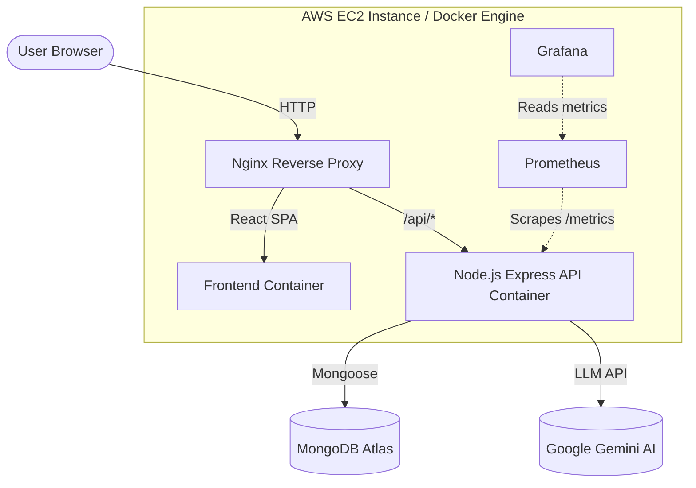
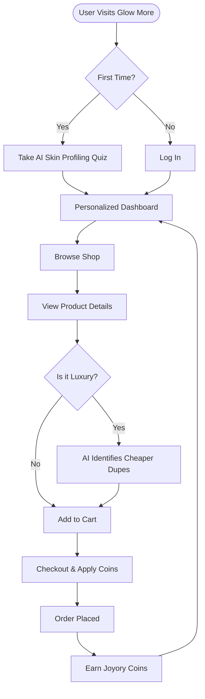

# 🌟 Glow More - Smart Beauty-Matching SaaS

Welcome to **Glow More**, an intelligent, AI-powered beauty and skincare matching platform. Glow More helps users discover products tailored precisely to their skin profile and budget while suggesting verified, affordable dupes for luxury items.

---

## 🎯 System Architecture

Glow More is built on a production-ready MERN stack with advanced 3D product viewing and comprehensive monitoring infrastructure.



---

## 🌊 Application Flowchart

The following flowchart illustrates the typical user journey, from profiling their skin to completing an order and earning rewards.



---

## ✨ Key Features & Code Flow

1. **AI Skin Profiling & Matching**
   - **Flow**: User inputs skin concerns -> React state (`ExplorePage.jsx`) -> Backend matches tags against `products.json` catalog.
2. **Contextual Dupe Finder**
   - **Flow**: User views a high-end product in `ProductDetail.jsx` -> System queries the catalog for items where `dupe_of` matches the current product ID -> Contextual dupes are rendered dynamically.
3. **Loyalty Rewards System**
   - **Flow**: `checkout` API (`order.controller.js`) calculates cart total -> applies promo/coin discounts -> calculates `Earned Coins` -> updates `User` and `RewardTransaction` collections atomically.
4. **Interactive 3D Previews**
   - **Flow**: `Product3DViewer.jsx` uses `@react-three/fiber` to load `.glb` models, enabling 360° interactive product inspection.
5. **Real-time Observability**
   - **Flow**: Express backend uses `prom-client` (`prometheus.js`) to expose business metrics (`product_matched_total`, `checkout_completed_total`) at `/metrics` -> Prometheus scrapes every 15s -> Grafana visualizes in the Glow More Analytics dashboard.

---

## 🛠️ Tech Stack

- **Frontend:** React 19, Vite, Tailwind CSS, Framer Motion, React Three Fiber (3D), Lucide Icons.
- **Backend:** Node.js, Express, Mongoose (MongoDB).
- **Monitoring:** Prometheus, Grafana, cAdvisor, Node Exporter.
- **Deployment:** Docker, Nginx, AWS EC2, GitHub Actions (CI/CD).

---

## 🚀 Quickstart for Local Development

1. **Clone the repository:**
   ```bash
   git clone https://github.com/mihir021/upkey.git
   cd upkey
   ```

2. **Install Dependencies:**
   ```bash
   # Install backend dependencies
   cd server && npm install
   
   # Install frontend dependencies
   cd ../client && npm install
   ```

3. **Environment Variables:**
   Create `.env` files in both `client` and `server` matching the `.env.example` templates.

4. **Run the Application:**
   ```bash
   # Terminal 1: Start Backend
   cd server && npm run dev
   
   # Terminal 2: Start Frontend
   cd client && npm run dev
   ```

5. **Run the Monitoring Stack (Optional):**
   ```bash
   docker compose --profile monitoring up -d
   ```
   - Grafana: `http://localhost:3000` (admin/admin)
   - Prometheus: `http://localhost:9090`
